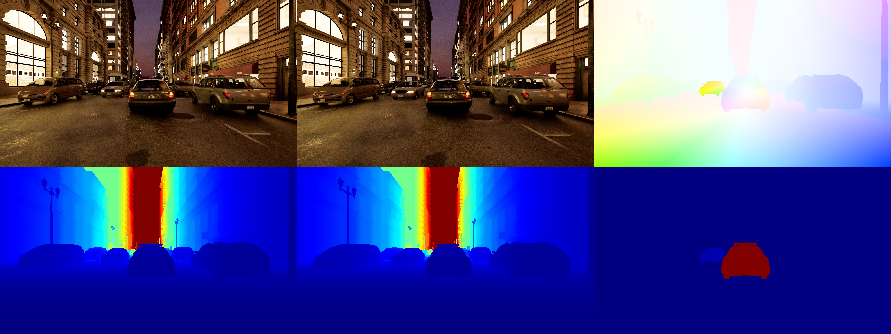
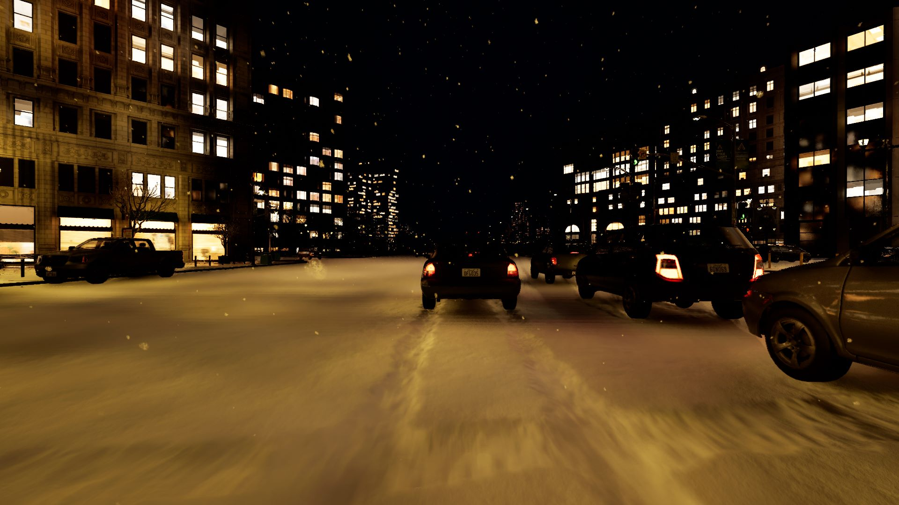
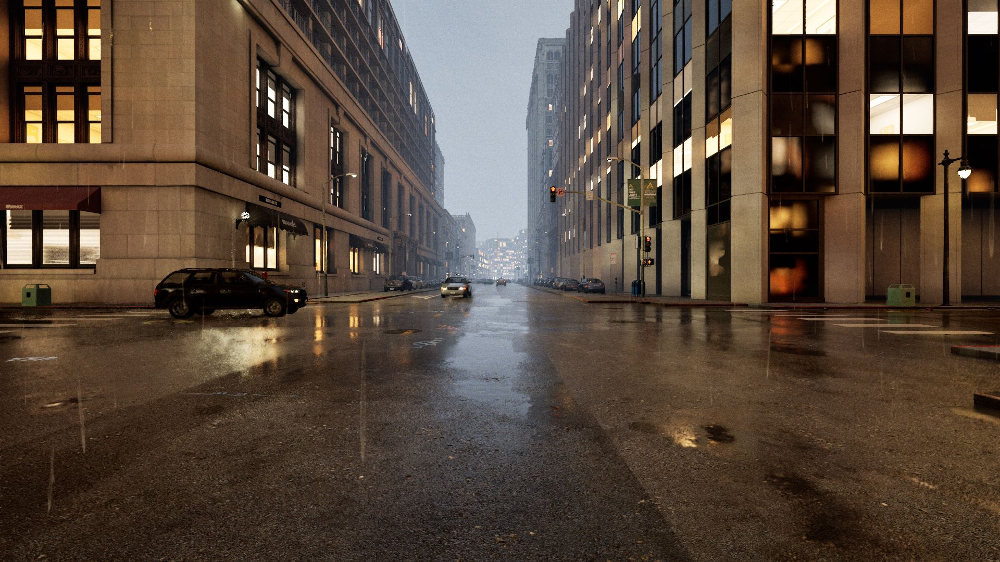
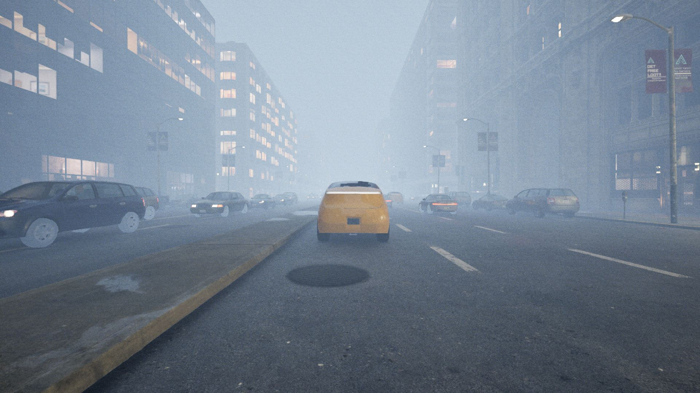
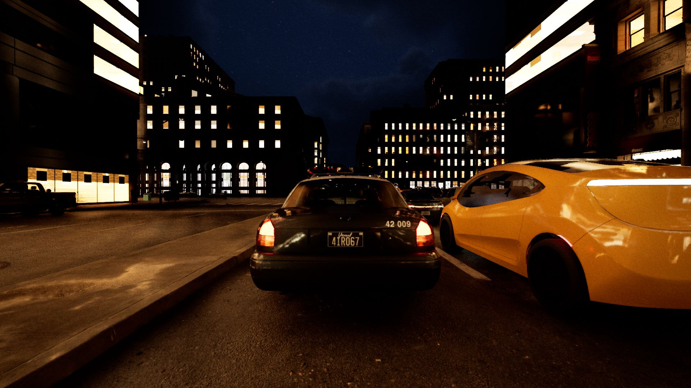
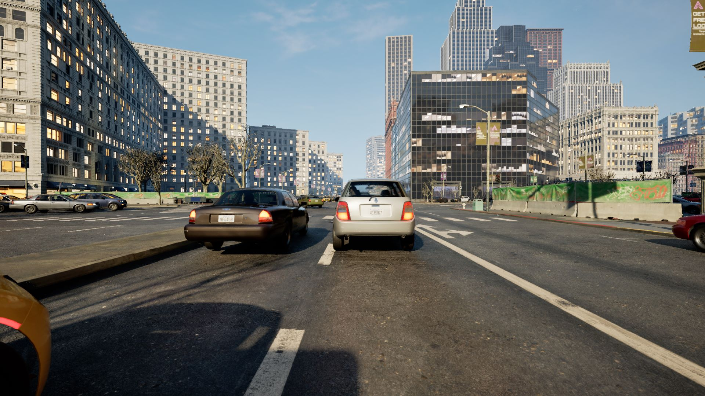
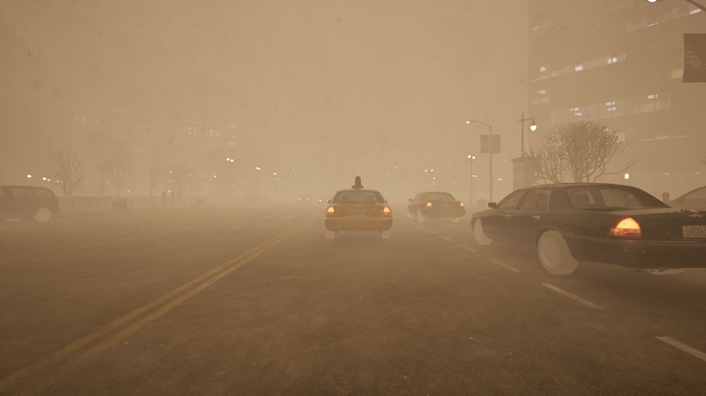
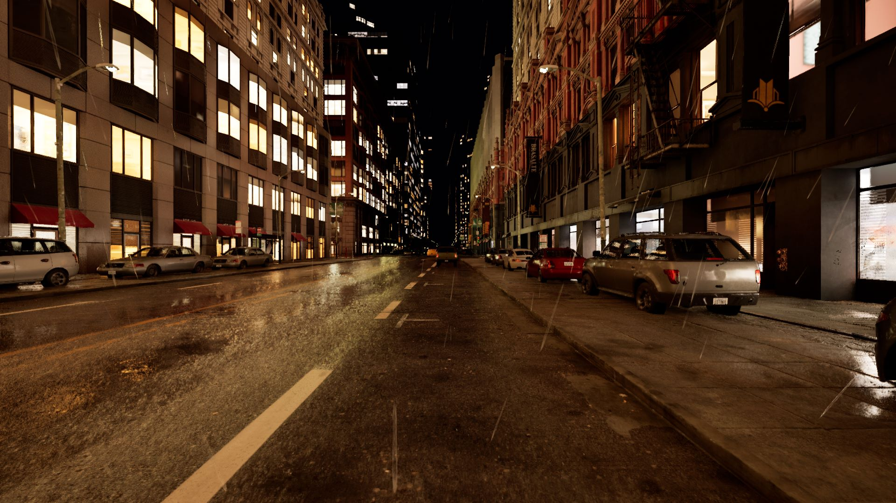
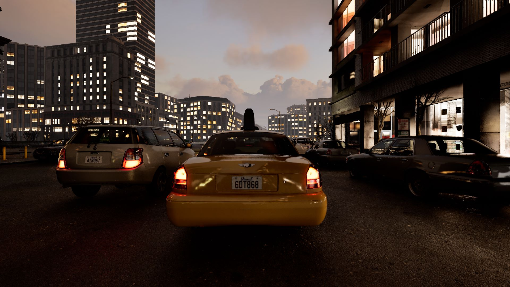

# d3: A High-fidelity Dynamic Driving Simulation Dataset for Stereo-depth and Sceneflow



...with a focus on various weather conditions:

<p float="left">
  
   
   
</p>
<p float="left">
  
   
   
</p>
<p float="left">
  
   
   
</p>

## Download Dataset
Download the datatset from Harvard Datavers (link coming soon) and extract the files. Your directory should look something like this:

```
- d3
    - intrinsics.json
    - test
        - 0001
            - left
            - right
            - meta
        - 0002
        - 0003
    - train
        - 0001
            - depth
            - flow
            - left
            - right
            - z_flow
            - meta
        - 0002
        - 0003
    
```

## Install Requirements
Create the `env`:
```
conda env create -f environment.yml
conda activate d3
```
Install `pytorch`. (The reader we provide is currently written for `pytorch`.)
```
conda install pytorch==1.13.1 torchvision==0.14.1 torchaudio==0.13.1 pytorch-cuda=11.6 -c pytorch -c nvidia -y
```


## Run the Sample Script
To run the script, pass in your `d3` path as an argument like this:
```
python sample_script.py --root_dir /path/to/d3
```

This script iterates through the training dataset and computes our metrics on the prediction against the ground truth

## References 
(d3 paper reference coming soon)
